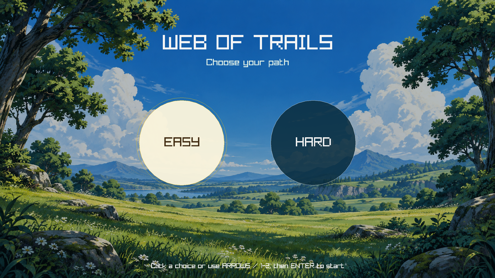
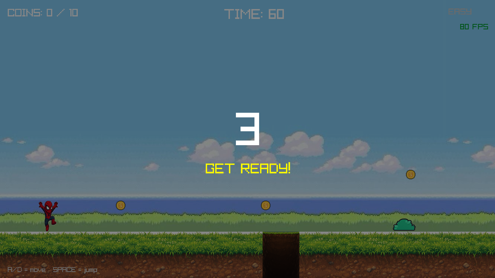
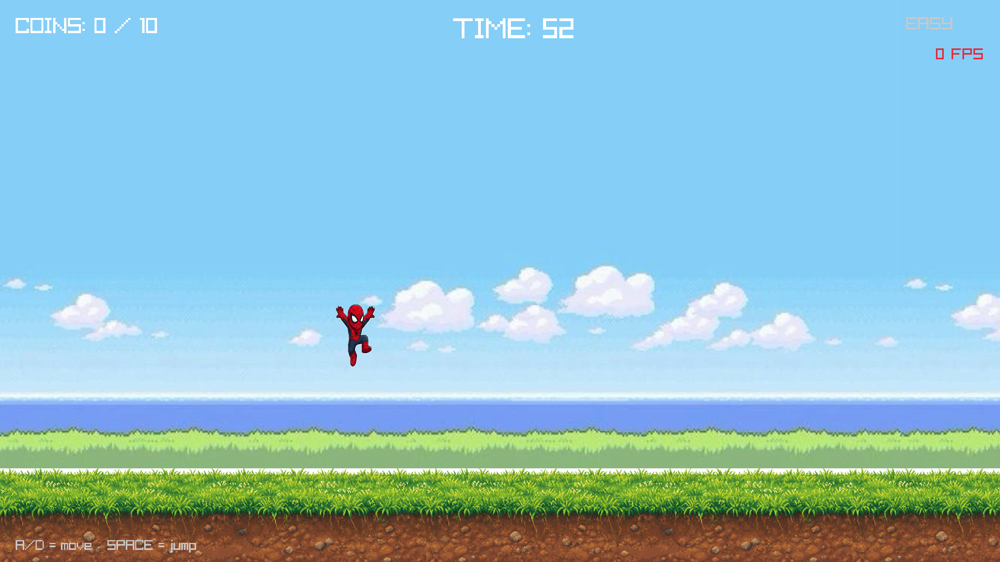
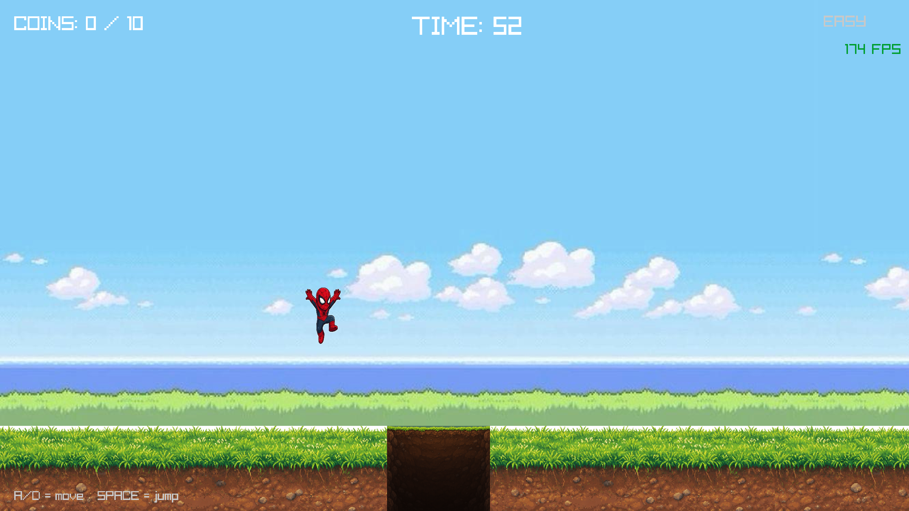
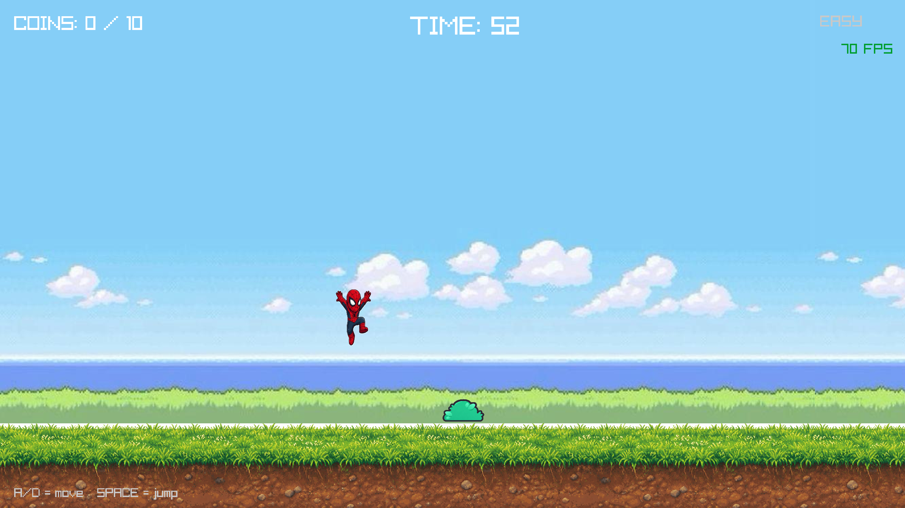
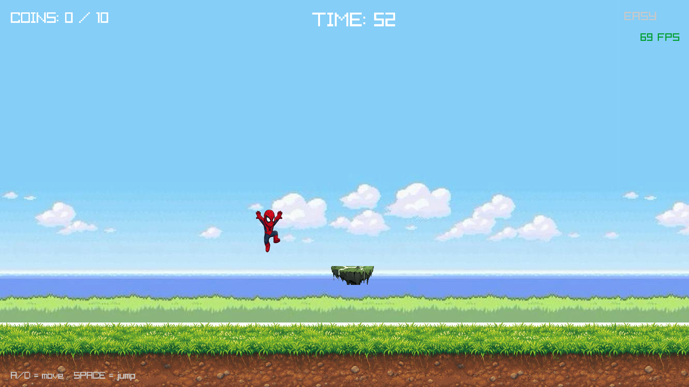
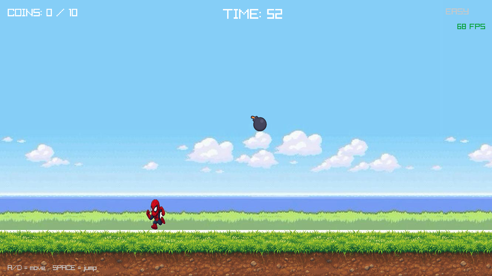
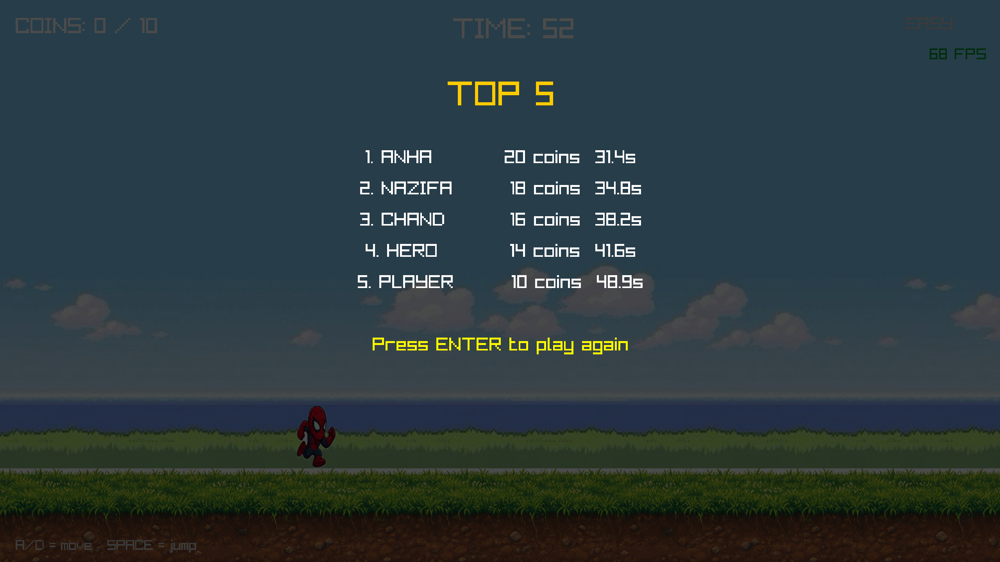
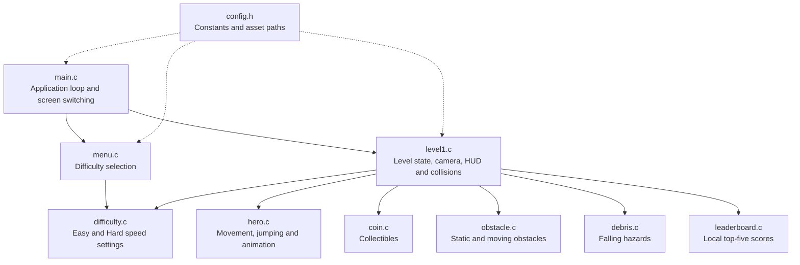

# Web of Trails

Web of Trails is a 2D side-scrolling runner built in C with
[raylib](https://www.raylib.com/). Choose a difficulty, collect enough coins,
avoid the hazards, and reach the end before time runs out.

## Screenshots

### Difficulty menu



### Gameplay



### Jumping

Press `W` or Space to jump. The hero uses a separate jump pose while airborne.



### Avoiding pits

Start the jump before reaching the edge and clear the entire opening before
landing.



### Avoiding a ground obstacle

Jump high enough for the hero's full collision area to pass over the obstacle.



### Avoiding a moving obstacle

Watch its vertical movement and jump when there is a safe opening.



### Avoiding falling debris

Move away from the warning position before the debris reaches the hero.



### Leaderboard

After a successful run, qualifying scores appear in the local top five.



## How to play

1. Select **Easy** or **Hard** from the opening menu.
2. Collect at least **10 coins**.
3. Jump over pits and obstacles, and avoid falling debris.
4. Reach the end of the level before the **60-second timer** expires.

Running into a normal obstacle blocks the hero but does not end the game.
Falling into a pit, being hit by falling debris, or running out of time causes
a game over.

## Controls

| Action | Keyboard control |
| --- | --- |
| Move left | `A` or Left Arrow |
| Move right | `D` or Right Arrow |
| Jump | `W` or Space |
| Select difficulty | Left/Right Arrow, `A`/`D`, or `1`/`2` |
| Start the game | Enter |
| Restart after losing | `R` |
| Continue after winning | Enter |

The difficulty options can also be selected with the mouse.

## Difficulty modes

- **Easy** uses a slower game speed and is best for learning the level.
- **Hard** increases the speed of the level and its hazards.

## Hazards and collectibles

| Item | Behaviour |
| --- | --- |
| Coin | Adds one coin to the player's score |
| Obstacle | Blocks the hero; jump over it to continue |
| Moving obstacle | Moves vertically and must be timed carefully |
| Pit | Ends the run after the hero falls into it |
| Falling debris | Shows a warning before falling; a direct hit ends the run |

## Game architecture

The game uses a small module-based architecture. `main.c` owns the application
loop and switches between the menu and gameplay. `level1.c` coordinates the
level modules and decides when the player wins or loses.



Each gameplay frame follows the same simple flow:

```text
Read input -> update the world -> check collisions and game state -> draw
```

## Project structure

```text
.
├── assets/                 Images, sprites, fonts, and level art
├── docs/screenshots/       Screenshots used in this README
├── src/
│   ├── main.c              Entry point and main loop
│   ├── config.h            Game settings and asset paths
│   ├── menu.c              Difficulty menu
│   ├── difficulty.c        Difficulty values
│   ├── level1.c            Level rules, layout, camera, HUD, and states
│   ├── hero.c              Hero controls and animation
│   ├── coin.c              Coin logic
│   ├── obstacle.c          Obstacle logic
│   ├── debris.c            Falling-debris logic
│   └── leaderboard.c       Local leaderboard logic
├── Makefile                Build commands
└── leaderboard.txt         Local scores, created when needed
```

Header files in `src/` define the public interface for each matching `.c`
module.

## Build and run

### Requirements

- A C99-compatible compiler
- GNU Make
- raylib 5.x

### macOS

Install raylib with Homebrew, then run the game from the project directory:

```bash
brew install raylib
make run
```

See [GETTING_STARTED.md](GETTING_STARTED.md) for more macOS and Linux setup
details.

### Windows

Follow [GETTING_STARTED_WINDOWS.md](GETTING_STARTED_WINDOWS.md) for the Visual
Studio setup.

### Useful commands

```bash
make        # Build the game at build/webhero
make run    # Build and start the game
make clean  # Remove compiled build files
```

Always start the game from the repository root so its relative asset paths can
be found.

## Leaderboard

After completing the level, enter a player name to save the result. The game
stores the best five scores locally in `leaderboard.txt`. Scores are ranked by
coins collected, with a faster completion time used as the tiebreaker.

The current leaderboard is local to one computer. A shared online leaderboard
would require a hosted database and server-side API.

## Changing settings or artwork

Most gameplay values and asset paths are collected in `src/config.h`. Use that
file to adjust values such as the time limit, required coins, movement speed,
screen size, or image filenames.

Artwork lives under `assets/`. When replacing an image, either keep its current
filename or update the corresponding path in `src/config.h`.

## Current scope

- One playable side-scrolling level
- Easy and Hard difficulty modes
- Coins, pits, obstacles, and falling debris
- Win, loss, restart, and countdown states
- Local top-five leaderboard
- Native desktop build using raylib

See [CONTRIBUTING.md](CONTRIBUTING.md) before making collaborative changes.
